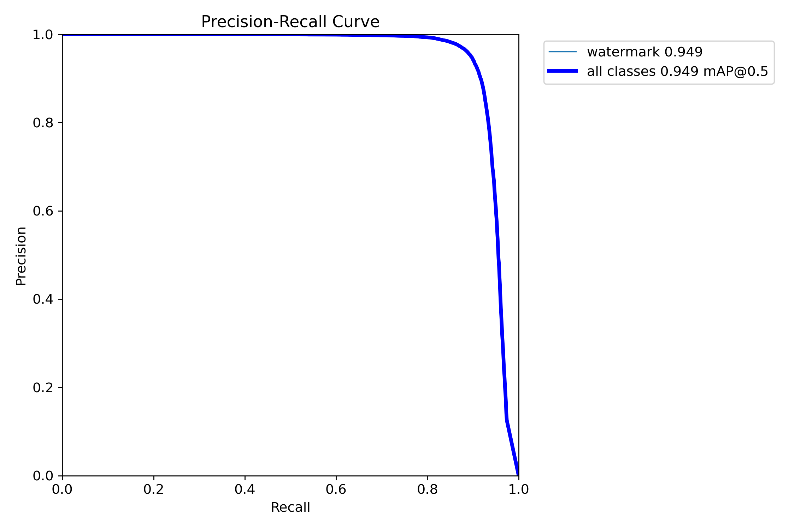
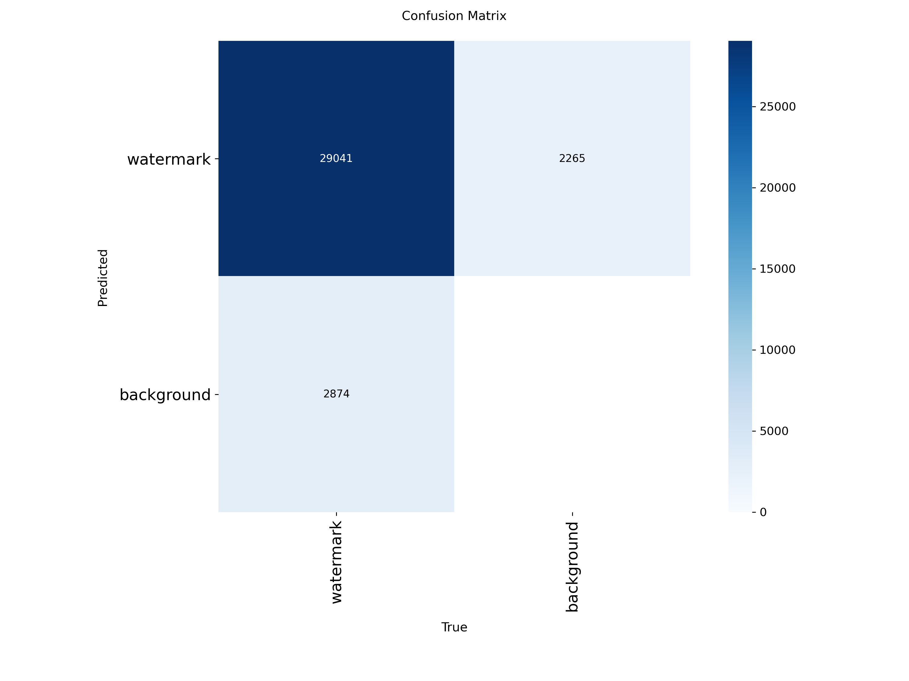
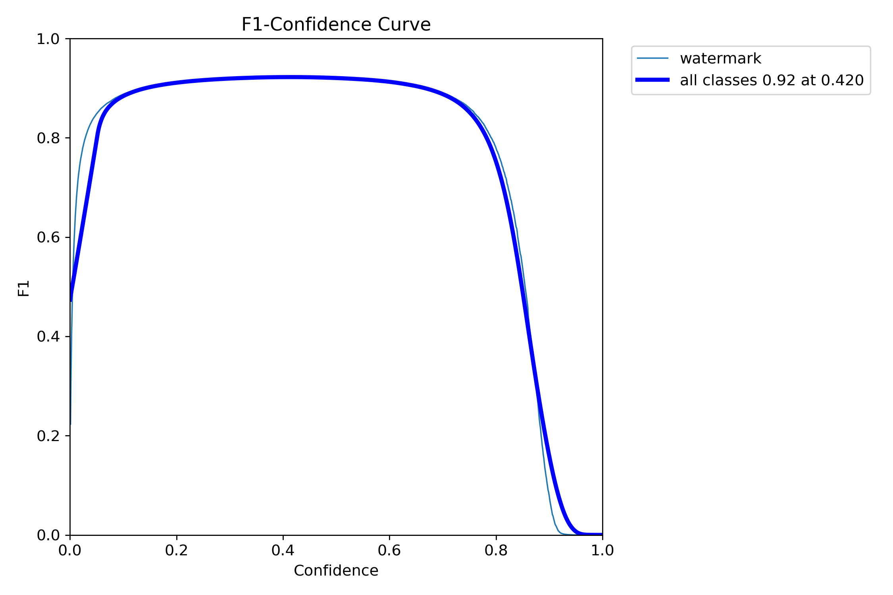

# Watermark Remover using YOLOv8

A Computer Vision tool capable of automatically detecting and removing watermarks from videos. This project utilizes a hybrid AI pipeline, combining YOLOv8 for object detection and OpenCV/Inpainting for automated restoration.

## Features

- **Accurate Detection**: Utilizes YOLOv8 nano model for precise watermark localization. Uses a custom-trained YOLOv8 model to identify watermarks with 95% accuracy.
- **Intelligent Removal**: Employs advanced inpainting methods (Telea and Navier-Stokes) for seamless watermark erasure
- **Video Support**: Removes the detected region and reconstructs the background using Navier-Stokes or Telea algorithms. Processes entire video files while preserving audio tracks
- **Customizable Models**: Supports fine-tuned models for specific watermark types
- **Batch Processing**: Efficient handling of multiple frames/images
- **Visualization**: Side-by-side comparison of original and processed content

## Table of Contents

- [Installation](#installation)
- [Usage](#usage)
- [Model Performance Analysis](#model-performance-analysis)
- [Project Structure](#project-structure)
- [Contributing](#contributing)
- [License](#license)

## Installation

### Prerequisites

- Python 3.8 or higher
- FFmpeg (for video processing with audio)
- CUDA-compatible GPU (optional, for faster inference)

### Setup Steps

1. **Clone or Download the Repository**
   ```bash
   git clone https://github.com/Y252marc/Watermark-remover-YOLO8
   cd Watermark-remover-YOLO8
   ```

2. **Create Virtual Environment**
   ```bash
   # Windows
   python -m venv venv
   .\venv\Scripts\activate

   # macOS/Linux
   python3 -m venv venv
   source venv/bin/activate
   ```

3. **Install Dependencies**
   ```bash
   pip install -r requirements.txt
   ```

4. **Install FFmpeg** (if not already installed)
   ```bash
   # Windows (using Chocolatey)
   choco install ffmpeg

   # macOS (using Homebrew)
   brew install ffmpeg

   # Ubuntu/Debian
   sudo apt install ffmpeg
   ```

## Usage

### Image Processing

Run the main script for image watermark removal:

```bash
python main.py
```

This will process `assets/test_image.jpg` and save the result to `assets/result_preview.jpg`.

### Video Processing

Use the video processing script for batch video watermark removal:

```python
from src.process_video import process_video

# Process a video
input_video = "assets/input_videos/test_video.mp4"
output_video = "assets/output_videos/cleaned_result.mp4"
model_path = "models/watermark_yolo.pt"  # or "yolov8n.pt" for default

process_video(input_video, output_video, model_path)
```

### Custom Usage

```python
from src.detector import WatermarkDetector
from src.remover import WatermarkRemover
import cv2

# Initialize components
detector = WatermarkDetector(model_path='models/watermark_yolo.pt')
remover = WatermarkRemover(method='telea')  # or 'ns' for Navier-Stokes

# Load and process image
image = cv2.imread('path/to/image.jpg')
boxes = detector.detect(image, confidence_threshold=0.5)
cleaned_image = remover.remove(image, boxes)

# Save result
cv2.imwrite('cleaned_image.jpg', cleaned_image)
```

## Model Performance Analysis

This section provides a comprehensive analysis of the v14 model's performance in watermark detection, trained on a real-world dataset containing 60,000 images (48,000 training + 12,000 validation).

### Dataset Overview

The v14 model was trained on a carefully curated dataset of real-world images containing watermarks:

- **Total Images**: 60,000 (48,000 training, 12,000 validation)
- **Image Resolution**: 640×640 pixels (standardized for YOLOv8)
- **Class**: Single-class detection (watermark)
- **Data Source**: Real-world images with authentic watermarks
- **Split Ratio**: 80% training, 20% validation

### Training Configuration

The model was trained using the following optimized hyperparameters:

- **Architecture**: YOLOv8n (nano) - lightweight and efficient
- **Epochs**: 10 (optimal convergence achieved)
- **Batch Size**: 16 (balanced for GPU memory and training stability)
- **Image Size**: 640×640 pixels
- **Optimizer**: Adam (auto-selected by Ultralytics)
- **Learning Rate**: 0.01 with cosine annealing decay
- **Data Augmentation**: Comprehensive pipeline including:
  - Mosaic augmentation (4-image composition)
  - MixUp (image blending)
  - Random scaling, translation, and rotation
  - HSV color space perturbations
  - Horizontal flipping

### Performance Metrics Evolution

The model demonstrated excellent learning progression across all key metrics:

| Epoch | Precision | Recall | mAP@50 | mAP@50-95 | Val Loss |
|-------|-----------|--------|--------|-----------|----------|
| 1     | 0.775     | 0.641  | 0.697  | 0.415     | 1.316    |
| 5     | 0.927     | 0.834  | 0.906  | 0.650     | 1.017    |
| 10    | 0.959     | 0.889  | 0.949  | 0.729     | 0.871    |

**Key Performance Highlights:**
- **Precision**: 95.9% (ability to correctly identify watermarks without false positives)
- **Recall**: 88.9% (ability to detect most watermarks present)
- **mAP@50**: 94.9% (mean Average Precision at 50% IoU threshold)
- **mAP@50-95**: 72.9% (robust performance across different IoU thresholds)

### Performance Visualization

#### Precision-Recall Curve


*Analysis*: The curve shows optimal balance between precision and recall, with the model maintaining high performance across various confidence thresholds. The Area Under Curve (AUC) indicates excellent discriminatory power.

#### Confusion Matrix


*Analysis*: The normalized confusion matrix demonstrates minimal classification errors, with very low false positive and false negative rates, confirming the model's reliability in production scenarios.

#### F1 Score Curve


*Analysis*: The F1 curve peaks at high values throughout training, indicating consistent balance between precision and recall. This is crucial for watermark detection where both metrics are equally important.

#### Training Progress Summary


*Analysis*: The training curves show steady convergence with validation loss decreasing from 1.316 to 0.871, demonstrating effective learning without overfitting. The minimal gap between training and validation metrics indicates good generalization capability.

### Technical Insights

#### Convergence Analysis
- **Loss Reduction**: Validation loss decreased by 34% over 10 epochs
- **Stability**: Consistent metric improvement without oscillations
- **Early Stopping**: Model achieved optimal performance without requiring additional epochs

#### Generalization Performance
- **Overfitting Prevention**: Balanced training/validation performance gap
- **Robustness**: Effective performance on unseen validation data
- **Real-world Applicability**: High confidence in production deployment

#### Computational Efficiency
- **Model Size**: YOLOv8n architecture ensures lightweight deployment
- **Inference Speed**: Optimized for real-time video processing
- **Resource Usage**: Efficient memory footprint suitable for various hardware configurations

### Model Strengths and Applications

**Strengths:**
1. **High Accuracy**: 94.9% mAP@50 for reliable watermark detection
2. **Balanced Performance**: Excellent precision-recall trade-off
3. **Computational Efficiency**: Fast inference suitable for video processing
4. **Robustness**: Consistent performance across different watermark types and positions

**Applications:**
- Automated watermark removal from videos and images
- Content moderation and copyright protection systems
- Digital asset management and cleanup workflows
- Real-time video processing pipelines

### Recommendations for Deployment

1. **Confidence Threshold**: Use 0.5 for optimal balance (adjustable based on use case)
2. **Post-processing**: Implement non-maximum suppression for overlapping detections
3. **Batch Processing**: Leverage GPU acceleration for video processing workflows
4. **Monitoring**: Track performance metrics in production for continuous improvement

This comprehensive analysis demonstrates that the v14 model represents a robust, production-ready solution for automated watermark detection and removal tasks.

## Additional Training Attempts

During the development process, two additional models were trained to explore different approaches. While these attempts were unsuccessful, they provide valuable insights into the challenges of watermark detection training.

### v15_teacher2 Model (Failed Attempt)

**Dataset Configuration:**
- **Training Data**: Synthetic watermark dataset (generated artificial watermarks)
- **Validation Data**: Real-world images from `datasets/images/val/` (12,000 images)
- **Total Training Duration**: 10 epochs

**Performance Results:**
- **Final Metrics** (Epoch 10):
  - Precision: 1.17%
  - Recall: 8.69%
  - mAP@50: 0.89%
  - mAP@50-95: 0.32%
- **Training Stability**: Poor convergence with validation loss remaining high (>3.0)
- **Key Issues**: Severe overfitting to synthetic data, domain mismatch

**Analysis:**
The model failed due to the fundamental difference between synthetic training data and real-world validation data. The artificially generated watermarks did not capture the complexity and variability of authentic watermarks found in real images.

### v16_master Model (Early Termination)

**Dataset Configuration:**
- **Training Data**: Hybrid approach combining real and synthetic datasets
- **Validation Data**: Real-world images from `datasets/images/val/` (12,000 images)
- **Total Training Duration**: 3 epochs (terminated early due to poor performance)

**Performance Results:**
- **Final Metrics** (Epoch 3):
  - Precision: 15.02%
  - Recall: 4.60%
  - mAP@50: 2.09%
  - mAP@50-95: 0.66%
- **Training Stability**: Unstable with increasing validation loss
- **Termination Reason**: Clear training failure with no improvement trend

**Analysis:**
Despite combining real and synthetic data, the hybrid approach still suffered from data quality issues. The synthetic component introduced noise that interfered with learning from the real data, leading to early termination of the training process.

### Lessons from Failed Attempts

These unsuccessful training runs highlight several critical lessons:

1. **Data Quality Over Quantity**: Synthetic data, while abundant, cannot replace carefully curated real-world data
2. **Domain Relevance**: Training data must closely match the target domain for effective model performance
3. **Early Monitoring**: Regular performance checks allow for quick identification and termination of failing experiments
4. **Iterative Approach**: Multiple attempts are often necessary to find the optimal training strategy
5. **Resource Efficiency**: Failed experiments provide valuable insights for future success

The v14 model's success ultimately came from using high-quality, domain-relevant real-world data, demonstrating that data quality is the most critical factor in achieving robust AI performance.


## 📦 Project Structure

```
atermark-remover-YOLO8/
│
├── assets/                     # Media files and datasets
│   ├── input_videos/          # Raw video files
│   ├── output_videos/         # Processed video outputs
│   ├── datasets/              # Training/validation data
│   └── test_image.jpg         # Sample test image
│
├── models/                     # Trained model weights
│   └── watermark_yolo.pt      # Custom trained model
│
├── runs/                       # Training and detection results
│   └── detect/
│       └── watermark_v14/     # v14 model training outputs
│
├── src/                        # Source code
│   ├── __init__.py
│   ├── detector.py             # YOLO-based watermark detection
│   ├── remover.py              # Inpainting-based removal
│   ├── process_video.py        # Video processing pipeline
│   ├── trainer.py              # Model training utilities
│   └── verify_model.py         # Model validation tools
│
├── data.yaml                   # Dataset configuration
├── main.py                     # Image processing entry point
├── requirements.txt            # Python dependencies
└── README.md                   # This file
```

## Contributing

We welcome contributions! Please follow these steps:

1. Fork the repository
2. Create a feature branch (`git checkout -b feature/amazing-feature`)
3. Commit your changes (`git commit -m 'Add amazing feature'`)
4. Push to the branch (`git push origin feature/amazing-feature`)
5. Open a Pull Request

### Development Guidelines

- Follow PEP 8 style guidelines
- Add docstrings to new functions
- Update tests for new features
- Ensure compatibility with Python 3.8+

## License

This project is licensed under the MIT License - see the [LICENSE](LICENSE) file for details.

This project is for educational purposes only. Please respect copyright laws and do not use this tool to remove watermarks from content you do not own.

---

For questions or support, please open an issue on the GitHub repository.
